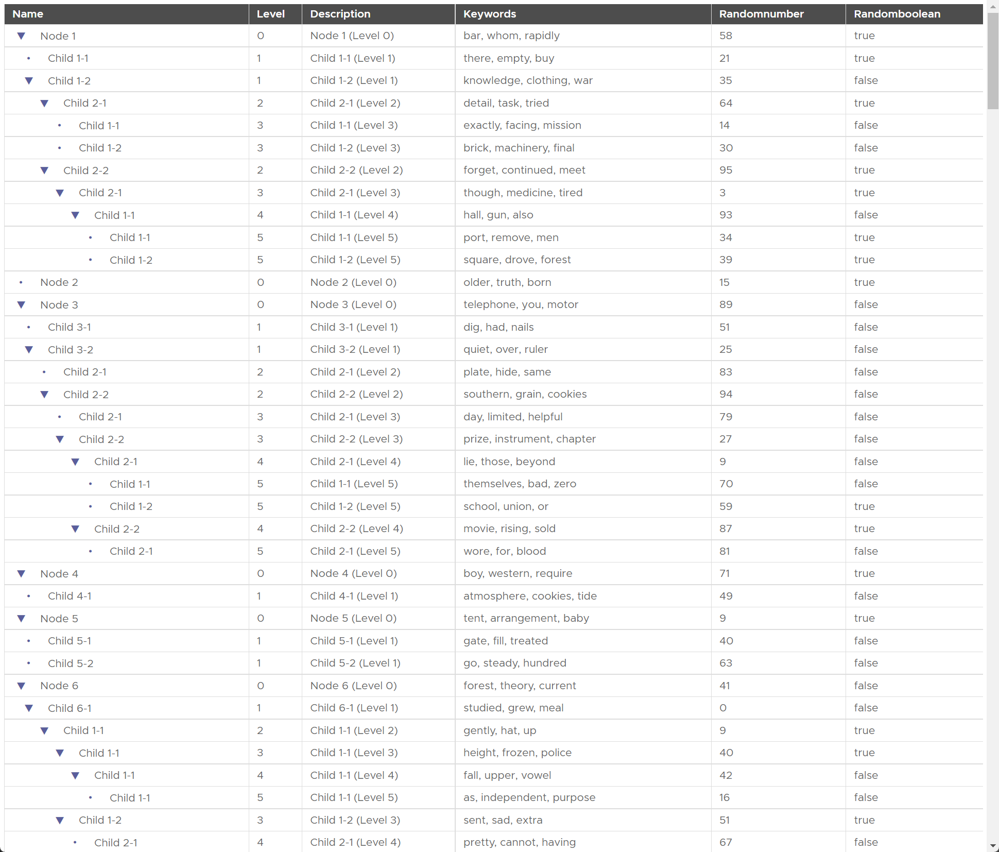

# Recursive Tree Table in Angular

This project, built by pair programming with ChatGPT, implements a recursive tree table in Angular with expand/collapse buttons. Each row in the table represents a node in the tree, and the tree can have multiple levels of nodes. The tree table is styled with a color palette and horizontal separators.

The tree data model includes a `name` and `description` field, and also includes random extra properties for each node. The tree table allows for row selection, and the data model has a `parent` and `level` property to facilitate the recursive structure of the tree.

**This README was also written by ChatGPT.**

## Running the App

To run the app, follow these steps:

1. Install the dependencies by running `npm install`.
2. Start the development server by running `ng serve`.
3. Open a web browser and go to `http://localhost:4200/`.
